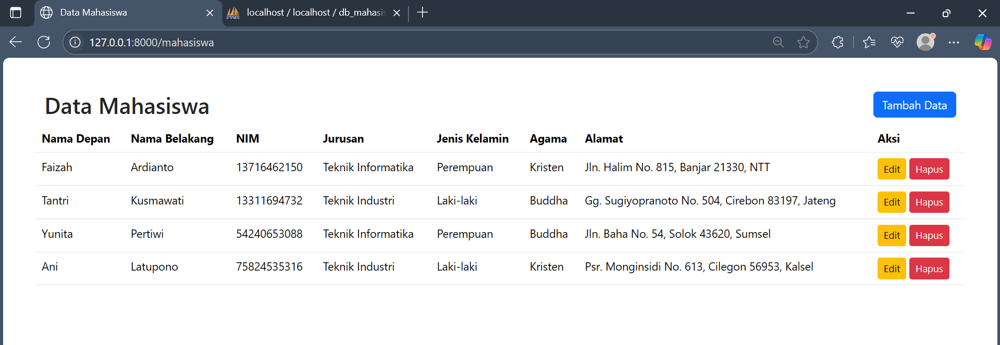

**Nama**: M Dimas Daniswara Putra
**NIM**: 22552011263
**Kelas**: TIF RP 22 CNS

# 📘 Data Mahasiswa - Laravel 11 CRUD
Aplikasi manajemen data mahasiswa berbasis Laravel 11, mencakup fitur **CRUD** sederhana: Tambah, Tampil, Edit, dan Hapus data.

## 🖼️ 1. Halaman Utama (Daftar Mahasiswa)
Menampilkan seluruh data mahasiswa dari database dalam bentuk tabel.

## ➕ 2. Form Tambah Data Mahasiswa
Form isian untuk menambahkan data baru.

  
  

## ✏️ 3. Form Edit Data Mahasiswa
Mengubah informasi mahasiswa yang sudah ada.

  
  

## 🗑️ 4. Hapus Data
Menghapus data mahasiswa tertentu.

  
  

